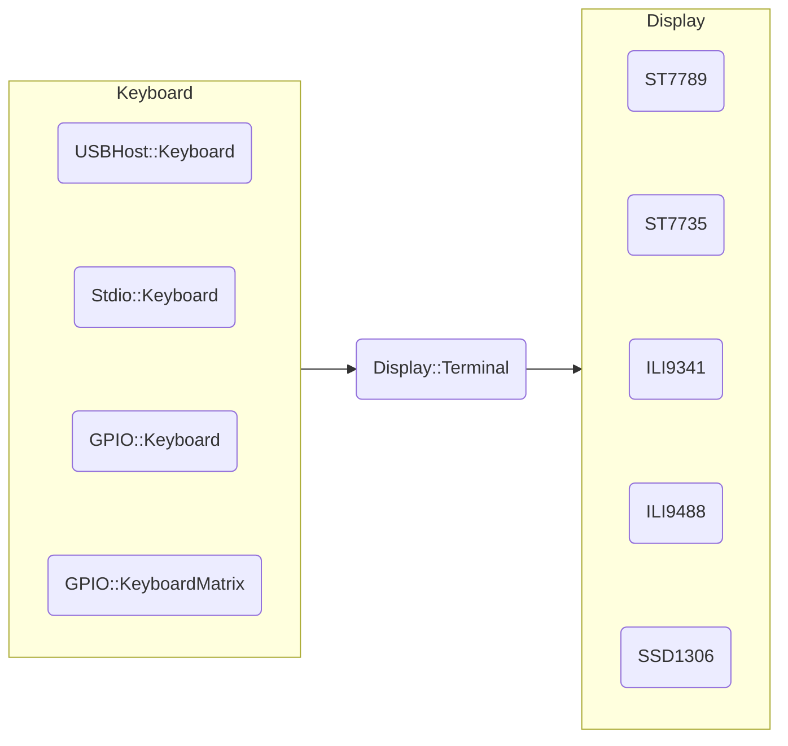
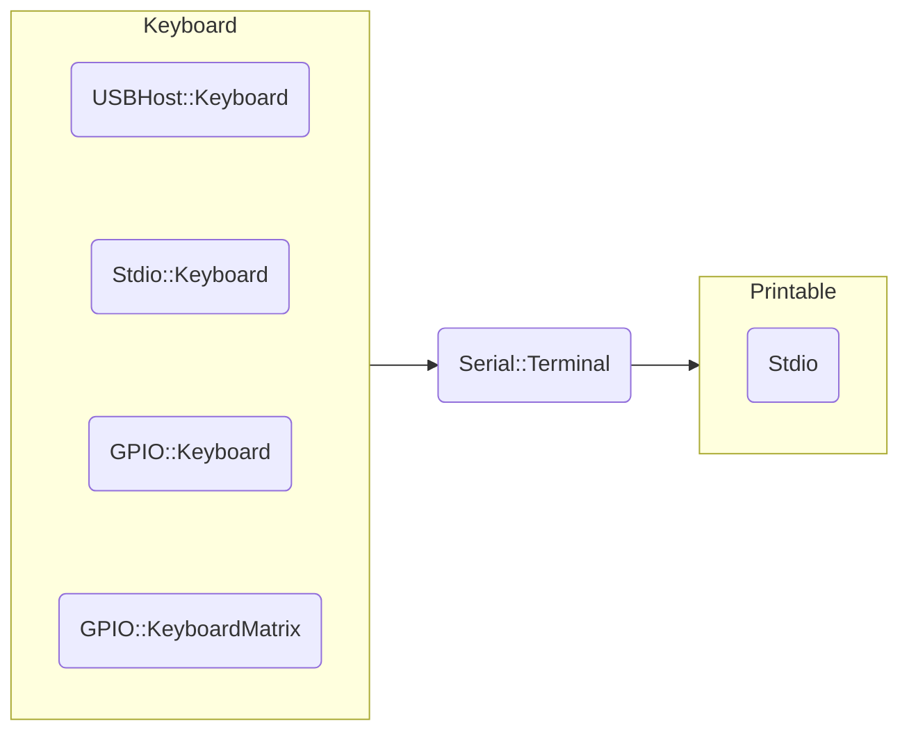

**pico-jxglib** は、ワンボードマイコン Raspberry Pi Pico の Pico SDK プログラミングをサポートするライブラリです。

https://zenn.dev/ypsitau/articles/2025-01-24-jxglib-intro

今回は Linux の bash シェルで使われている readline に似たコマンドライン編集機能を Pico ボードで実現する話です。USB キーボードはもちろん、タクトスイッチやキーボードマトリクスも入力デバイスとして使えますし、PC とのシリアル通信上でもコマンドライン編集が可能になります。

## コマンドライン編集機能について

**pico-jxglib** のコマンドライン編集機能は以下のキー操作を処理します。

| Ctrl キー  |単独キー|機能 |
|:----------:|:------:|:---------------------------------------|
|`Ctrl` + `P`|`Up`    |一つ前のヒストリを表示します               |
|`Ctrl` + `N`|`Down`  |一つ後のヒストリを表示します               |
|`Ctrl` + `B`|`Left`  |カーソルを一文字左に移動します             |
|`Ctrl` + `F`|`Right` |カーソルを一文字右に移動します             |
|`Ctrl` + `A`|`Home`  |カーソルを行の先頭に移動します             |
|`Ctrl` + `E`|`End`   |カーソルを行の最後に移動します             |
|`Ctrl` + `D`|`Delete`|カーソル位置の文字を消去します             |
|`Ctrl` + `H`|`Back`  |カーソル位置の一つ前の文字を消去します      |
|`Ctrl` + `J`|`Return`|入力内容を確定します                      |
|`Ctrl` + `K`|        |カーソル位置から末尾までを消去します        |
|`Ctrl` + `U`|        |カーソル位置の一つ前から行頭までを消去します |

## 二つの Terminal

コマンドライン編集機能は、以下の二つの Terminal で利用できます。

- `Display::Terminal` ... Pico ボードに接続したディスプレイに文字を描画します。ほかのデバイスを必要とせず、Pico 単独でコマンド入力を受け付けることができます
- `Serial::Terminal` .. PC などのホストとシリアル通信をします。コマンドの実行内容などをホスト側で保存したりできます

`Display::Terminal` は `ST7789` などのディスプレイデバイスを出力先に指定し、入力機器として `USBHost::Keyboard` (USB キーボード)、`Stdio::Keyboard` (Stdio を経由したホストからのキーボード入力)、`GPIO::Keyboard` (GPIO のスイッチ入力)、`GPIO::KeyboardMatrix` (GPIO にマトリクス接続されたスイッチ入力) を設定します。

`Serial::Terminal` は Stdio を出力先に指定します[^serial-output]。入力機器として `USBHost::Keyboard`、`Stdio::Keyboard`、`GPIO::Keyboard`、`GPIO::KeyboardMatrix` を設定します。

[^serial-output]: 将来ソケットインターフェースが追加される予定です

