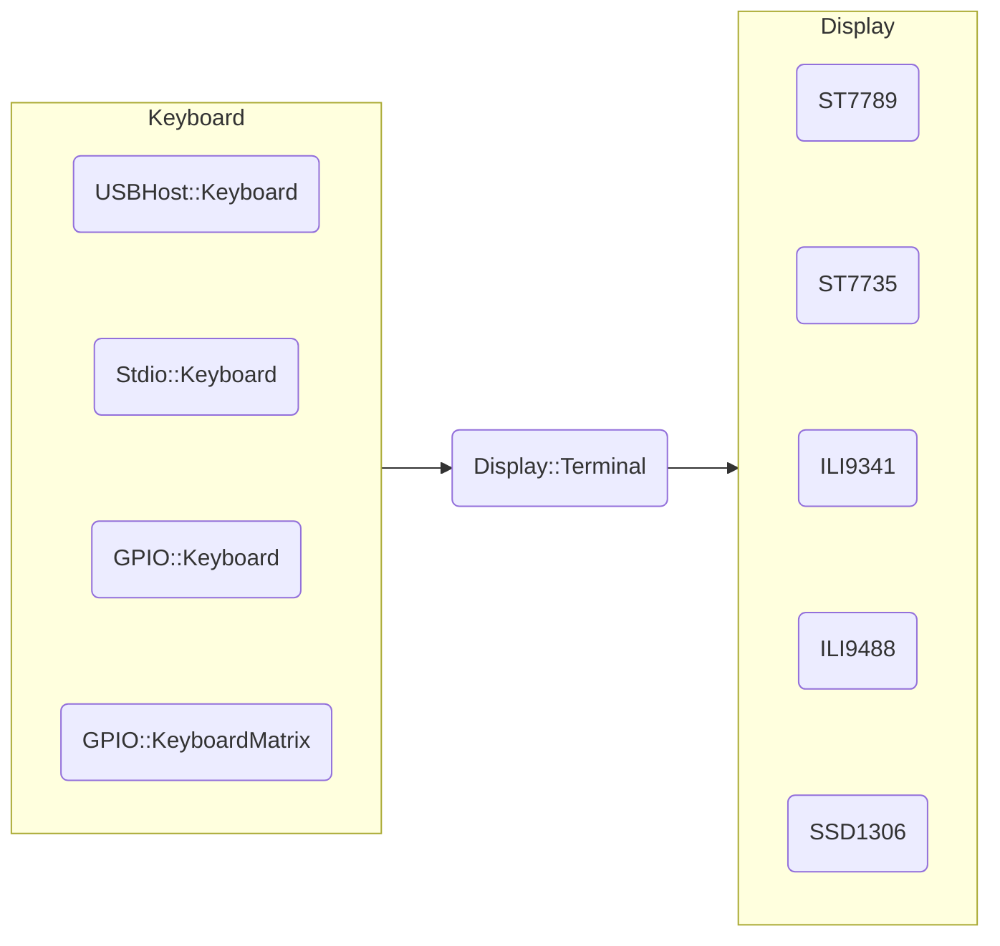
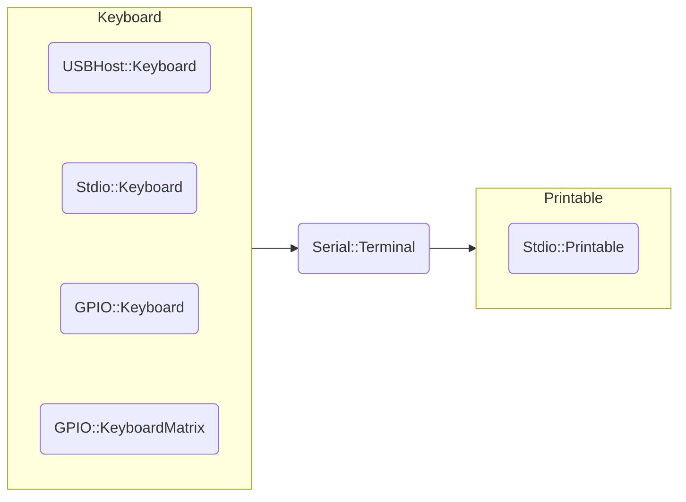

[**pico-jxglib**](https://zenn.dev/ypsitau/articles/2025-01-24-jxglib-intro) は、ワンボードマイコン Raspberry Pi Pico の Pico SDK プログラミングをサポートするライブラリです。

前の記事では、Pico の USB ホスト機能を使って USB キーボードとマウスを接続する方法について説明しました。

https://zenn.dev/ypsitau/articles/2025-04-02-usbhost-keyboard-mouse

今回はこの Pico ボードにコマンドライン編集機能を追加する話です。USB キーボードはもちろん、タクトスイッチやキーボードマトリクスも入力デバイスとして使えますし、PC とのシリアル通信上でもコマンドライン入力が可能になります。

## コマンドライン編集機能について

- 以下の編集機能を持ちます

  | キー |単独キー|機能 |
  |:-:|:-:|:-:|
  |`Ctrl` + `P`|`Up`  |  |
  |`Ctrl` + `N`|`Down`|  |
  |`Ctrl` + `B`|`Left`|  |
  |`Ctrl` + `F`|`Right`|  |
  |`Ctrl` + `A`|`Home`|  |
  |`Ctrl` + `E`|`End`|  |
  |`Ctrl` + `D`|`Delete`|  |
  |`Ctrl` + `H`|`Back`|  |
  |`Ctrl` + `J`|`Return`|  |
  |`Ctrl` + `K`| |  |
  |`Ctrl` + `U`| |  |

- ヒストリ機能を持ちます

## 二つの Terminal

[「pico-jxglib と Terminal の話」](https://zenn.dev/ypsitau/articles/2025-02-19-terminal) で TFT LCD や OLED に文字情報を表示する Terminal の機能を実装しました。**pico-jxglib** が扱う Terminal にはこれらディスプレイを表示機器にする `Dislay::Terminal` と、シリアル通信で文字情報を表示する `Serial::Terminal` があります。

`Display::Terminal` は `ST7789` などのディスプレイ機器を出力先に指定し、入力機器として `USBHost::Keyboard`、`Stdio::Keyboard`、`GPIO::Keyboard`、`GPIO::KeyboardMatrix` を設定します。

`Serial::Terminal` は `Stdio::Printable` を出力先に指定します[^serial-output]。入力機器として `USBHost::Keyboard`、`Stdio::Keyboard`、`GPIO::Keyboard`、`GPIO::KeyboardMatrix` を設定します。

[^serial-output]: 将来ソケットインターフェースが追加される予定です

