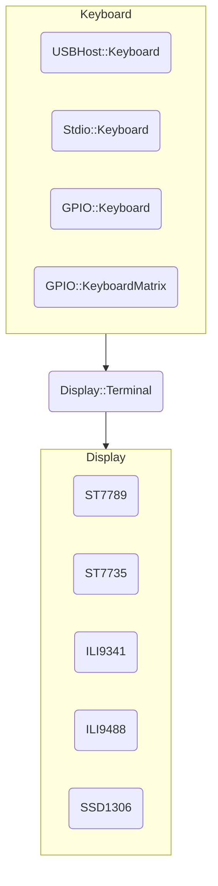
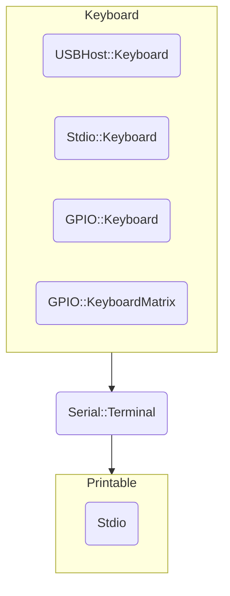

**pico-jxglib** は、ワンボードマイコン Raspberry Pi Pico の Pico SDK プログラミングをサポートするライブラリです。

https://zenn.dev/ypsitau/articles/2025-01-24-jxglib-intro

今回は Linux の bash シェルで使われている readline に似たコマンドライン編集機能を Pico ボードで実現する話です。USB キーボードはもちろん、タクトスイッチやキーボードマトリクスも入力デバイスとして使えますし、PC とのシリアル通信上でもコマンドライン編集が可能になります。

## コマンドライン編集機能について

**pico-jxglib** のコマンドライン編集機能は以下のキー操作を処理します。

| Ctrl キー  |単独キー|機能                                      |
|:----------:|:------:|:---------------------------------------|
|`Ctrl` + `P`|`Up`    |一つ前のヒストリを表示します               |
|`Ctrl` + `N`|`Down`  |一つ後のヒストリを表示します               |
|`Ctrl` + `B`|`Left`  |カーソルを一文字左に移動します             |
|`Ctrl` + `F`|`Right` |カーソルを一文字右に移動します             |
|`Ctrl` + `A`|`Home`  |カーソルを行の先頭に移動します             |
|`Ctrl` + `E`|`End`   |カーソルを行の最後に移動します             |
|`Ctrl` + `D`|`Delete`|カーソル位置の文字を消去します             |
|`Ctrl` + `H`|`Back`  |カーソル位置の一つ前の文字を消去します      |
|`Ctrl` + `J`|`Return`|入力内容を確定します                      |
|`Ctrl` + `K`|        |カーソル位置から末尾までを消去します        |
|`Ctrl` + `U`|        |カーソル位置の一つ前から行頭までを消去します |

Pico ボードに接続したディスプレイを使う場合はさらに以下のキー操作を処理します。

| Ctrl キー  |単独キー   |機能                                                                    |
|:----------:|:--------:|:----------------------------------------------------------------------|
|            |`PageUp`  |ロールバック画面を一行上に移動します。`Shift` を押すとページ単位で移動します |
|            |`PageDown`|ロールバック画面を一行下に移動します。`Shift` を押すとページ単位で移動します |

## 二つの Terminal

コマンドライン編集機能は、以下の二つの Terminal で利用できます。

- `Display::Terminal` ... Pico ボードに接続したディスプレイに文字を描画します。ほかのデバイスを必要とせず、Pico 単独でコマンド入力を受け付けることができます
- `Serial::Terminal` .. PC などのホストとシリアル通信をします。コマンドの実行内容などをホスト側で保存したりできます

`Display::Terminal` は `ST7789` などのディスプレイデバイスを出力先に指定し、入力機器として `USBHost::Keyboard` (USB キーボード)、`Stdio::Keyboard` (Stdio を経由したホストからのキーボード入力)、`GPIO::Keyboard` (GPIO のスイッチ入力)、`GPIO::KeyboardMatrix` (GPIO にマトリクス接続されたスイッチ入力) を設定します。



`Serial::Terminal` は Stdio を出力先に指定します[^serial-output]。入力機器として `USBHost::Keyboard`、`Stdio::Keyboard`、`GPIO::Keyboard`、`GPIO::KeyboardMatrix` を設定します。

[^serial-output]: 将来ソケットインターフェースが追加される予定です



## 実際のプロジェクト

### 開発環境のセットアップ

Visual Studio Code や Git ツール、Pico SDK のセットアップが済んでいない方は[「Pico SDK ことはじめ」](https://zenn.dev/ypsitau/articles/2025-01-17-picosdk#%E9%96%8B%E7%99%BA%E7%92%B0%E5%A2%83) をご覧ください。

**pico-jxglib** は GitHub からレポジトリをクローンすることで入手できます。
```
git clone https://github.com/ypsitau/pico-jxglib.git
cd pico-jxglib
git submodule update --init
```

:::message
**pico-jxglib** はほぼ毎日更新されています。すでにクローンしている場合は、`pico-jxglib` ディレクトリで以下のコマンドを実行して最新のものにしてください。

```
git pull
```
:::

### プロジェクトの作成

VSCode のコマンドパレットから `>Raspberry Pi Pico: New Pico Project` を実行し、以下の内容でプロジェクトを作成します。Pico SDK プロジェクト作成の詳細や、ビルド、ボードへの書き込み方法については[「Pico SDK ことはじめ」](https://zenn.dev/ypsitau/articles/2025-01-17-picosdk#%E3%83%97%E3%83%AD%E3%82%B8%E3%82%A7%E3%82%AF%E3%83%88%E3%81%AE%E4%BD%9C%E6%88%90%E3%81%A8%E7%B7%A8%E9%9B%86) を参照ください。

- **Name** ... プロジェクト名を入力します。今回は例として `cmdedittest` を入力します
- **Board type** ... ボード種別を選択します
- **Location** ... プロジェクトディレクトリを作る一つ上のディレクトリを選択します
- **Stdio support** .. Stdio に接続するポート (UART または USB) を選択しますが、USB はこのプログラムで使うので選択できません。UART のみ選択するか、どちらも未チェックのままにしておきます
- **Code generation options** ... **`Generate C++ code` にチェックをつけます**


プロジェクトディレクトリと `pico-jxglib` のディレクトリ配置が以下のようになっていると想定します。

```
+-[pico-jxglib]
+-[cmdedittest]
  +-CMakeLists.txt
  +-cmdedittest.cpp
  +- ...
```

以下、このプロジェクトをもとに `CMakeLists.txt` やソースファイルを編集してプログラムを作成していきます。

### Display::Terminal を使う

Pico ボードにキーボードとディスプレイをつなげて、Pico ボード単体でコマンド入力ができます。いろいろな組み合わせが可能なので、いくつか具体例を紹介します。

#### USB キーボード + TFT LCD

USB キーボードは USB 端子に microB-TypeA 変換アダプタを使って接続します。TFT LCD は ST7789 を使用しますが、他のディスプレイデバイスを接続する場合は[「pico-jxblib と TFT LCD の話」](https://zenn.dev/ypsitau/articles/2025-01-27-tft-lcd) を参照してください。
。

ブレッドボードの配線イメージを以下に示します。5V の電源をPico ボードの VBUS (40 番ピン) につなげていることに注意してください。


`CMakeLists.txt` の最後に以下の行を追加してください。

```cmake:CMakeLists.txt
target_link_libraries(cmdedittest jxglib_USBHost jxglib_ST7789)
add_subdirectory(${CMAKE_CURRENT_LIST_DIR}/../pico-jxglib pico-jxglib)
jxglib_configure_USBHost(cmdedittest CFG_TUH_HID 3)
```

ソースファイルを以下のように編集します。

```cpp:cmdedittest.cpp
#include <stdio.h>
#include "pico/stdlib.h"
#include "jxglib/USBHost.h"
#include "jxglib/ST7789.h"
#include "jxglib/Font/shinonome16.h"

using namespace jxglib;

Display::Terminal terminal;

int main()
{
    ::stdio_init_all();
    USBHost::Initialize();
    ::spi_init(spi1, 125 * 1000 * 1000);
    GPIO14.set_function_SPI1_SCK();
    GPIO15.set_function_SPI1_TX();
    ST7789 display(spi1, 240, 320, {RST: GPIO10, DC: GPIO11, CS: GPIO12, BL: GPIO13});
    display.Initialize(Display::Dir::Rotate0);
    terminal.SetFont(Font::shinonome16).AttachDisplay(display).AttachKeyboard(USBHost::GetKeyboard());
    terminal.Println("ReadLine Test Program");
    for (;;) {
        terminal.Printf("%s\n", terminal.ReadLine(">"));
    }
}
```

#### USB キーボード + OLED

USB キーボードは USB 端子に microB-TypeA 変換アダプタを使って接続します。OLED は SSD1306 を使用します。

ブレッドボードの配線イメージを以下に示します。5V の電源をPico ボードの VBUS (40 番ピン) につなげていることに注意してください。


`CMakeLists.txt` の最後に以下の行を追加してください。

```cmake:CMakeLists.txt
target_link_libraries(cmdedittest jxglib_USBHost jxglib_SSD1306)
add_subdirectory(${CMAKE_CURRENT_LIST_DIR}/../pico-jxglib pico-jxglib)
jxglib_configure_USBHost(cmdedittest CFG_TUH_HID 3)
```

ソースファイルを以下のように編集します。

```cpp:cmdedittest.cpp
#include <stdio.h>
#include "pico/stdlib.h"
#include "jxglib/USBHost.h"
#include "jxglib/SSD1306.h"
#include "jxglib/Font/shinonome12"

using namespace jxglib;

Display::Terminal terminal;

int main()
{
    ::stdio_init_all();
    USBHost::Initialize();
    ::i2c_init(i2c0, 400 * 1000);
    GPIO4.set_function_I2C0_SDA().pull_up();
    GPIO5.set_function_I2C0_SCL().pull_up();
    SSD1306 display(i2c0, 0x3c);
    display.Initialize();
    terminal.SetFont(Font::shinonome12).AttachDisplay(display).AttachKeyboard(USBHost::GetKeyboard());
    terminal.Println("ReadLine Test Program");
    for (;;) {
        terminal.Printf("%s\n", terminal.ReadLine(">"));
    }
}
```

#### GPIO キーボードマトリクス + TFT LCD

GPIO に接続したキーボードマトリクス接続します。ここでは Amazon などで容易に入手できる 4x4 マトリクスタイプのものを使用します。


ブレッドボードの配線イメージを以下に示します。5V の電源をPico ボードの VBUS (40 番ピン) につなげていることに注意してください。


`CMakeLists.txt` の最後に以下の行を追加してください。

```cmake:CMakeLists.txt
target_link_libraries(cmdedittest jxglib_USBHost jxglib_ST7789)
add_subdirectory(${CMAKE_CURRENT_LIST_DIR}/../pico-jxglib pico-jxglib)
```

ソースファイルを以下のように編集します。

```cpp:cmdedittest.cpp
#include <stdio.h>
#include "pico/stdlib.h"
#include "jxglib/ST7789.h"
#include "jxglib/Font/shinonome16.h"

using namespace jxglib;

Display::Terminal terminal;

int main()
{
    ::stdio_init_all();
    GPIO::KeyboardMatrix keyboard;
    const GPIO::KeySet keySetTbl[] = {
        VK_1,    VK_2, VK_3,     VK_BACK,
        VK_4,    VK_5, VK_6,     VK_UP,
        VK_7,    VK_8, VK_9,     VK_DOWN,
        VK_LEFT, VK_0, VK_RIGHT, VK_RETURN,
    };
    const GPIO::KeyRow keyRowTbl[] = { GPIO16, GPIO17, GPIO18, GPIO19 };
    const GPIO::KeyCol keyColTbl[] = { GPIO20.pull_up(), GPIO21.pull_up(), GPIO26.pull_up(), GPIO27.pull_up() };
    keyboard.Initialize(keySetTbl, keyRowTbl, count_of(keyRowTbl), keyColTbl, count_of(keyColTbl), GPIO::LogicNeg);
    ::spi_init(spi1, 125 * 1000 * 1000);
    GPIO14.set_function_SPI1_SCK();
    GPIO15.set_function_SPI1_TX();
    ST7789 display(spi1, 240, 320, {RST: GPIO10, DC: GPIO11, CS: GPIO12, BL: GPIO13});
    display.Initialize(Display::Dir::Rotate0);
    terminal.SetFont(Font::shinonome16).AttachDisplay(display).AttachKeyboard(keyboard);
    terminal.Println("ReadLine Test Program");
    for (;;) {
        terminal.Printf("%s\n", terminal.ReadLine(">"));
    }
}
```


`keyColTbl` 中の `pull_up()` を `pull_down()` にして、`keyboardInitialize()` の `GPIO::LogicNeg` を `GPIO::LogicPos` にしてください。

### Serial::Terminal を使う

