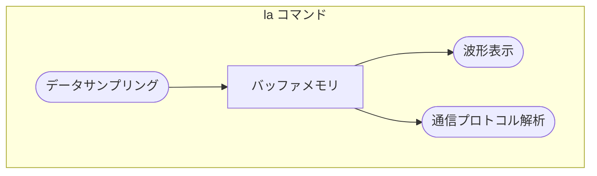

[pico-jxgLABO](https://zenn.dev/ypsitau/articles/2025-08-01-labo-intro) は、USB ケーブル一本でマイコンボード RaspberryPi Pico の様々な機能を試すことができる実験プラットフォームです。

この記事では、pico-jxgLABO のロジックアナライザコマンド `la` の機能を紹介します。`la` コマンドはコンソールベースのツールで、GUI アプリ PulseView と連携するときはバックエンドで黙々と動作するだけの存在です。でも、このコマンド単体でも波形表示ができますし、I2C や SPI、UART などの通信プロトコル解析もできるんです。本記事を通じて、`la` コマンドの便利さを知っていただけれると嬉しいです。

PulseView との連携については以下の記事を参照ください。

▶️ [pico-jxgLABO × PulseView: プローブ接続いらずで気軽に使えるロジックアナライザを体験しよう!](https://zenn.dev/ypsit/articles/2025-09-01-labo-pulseview)

## pico-jxgLABO の書き込み

Pico ボードへの pico-jxgLABO の書き込みと基本的な使い方は[こちら](https://zenn.dev/ypsitau/articles/2025-08-01-labo-intro#pico-jxglabo-%E3%81%AE%E5%B0%8E%E5%85%A5%E6%96%B9%E6%B3%95)。特別なハードウェアは必要なく、Pico や Pico 2 ボードを USB ケーブルで PC に接続するだけで始められます。ターミナルソフトを使ってコマンドを入力し、Pico ボードを操作します。

この記事で説明する実験を行うには、バージョン **0.2.0** 以降の pico-jxgLABO が Pico ボードに書き込まれている必要があります。ターミナルソフトで `about-me` コマンドを実行すると pico-jxgLABO のバージョンを確認できます。

```text
L:/>about-me
Program Information
 name:              pico-jxgLABO
 version:           0.2.0
     :
     :
```

## `la` コマンドの機能

`la` コマンドの機能は大きく分けて二つあり、一つはデータサンプリング、もう一つは波形表示および解析です。データサンプリングで信号データをバッファメモリにとりこみ、そのバッファメモリを参照して波形表示や通信プロトコル解析を行うという流れになります。



一度データサンプリングを行えば、バッファメモリの内容は次のデータサンプリング操作まで保存されるので、波形表示や解析を何度でも実行できます。

### データサンプリング

#### データサンプリングの開始と停止

`la` コマンドの `-p` (または `--pins`) オプションで測定する GPIO ピンを指定し、`enable` サブコマンドを実行することでサンプリングを開始します。

```text
L:/>la -p 2,3,4 enable
```

GPIO ピンはピン番号をカンマで区切って指定します。ハイフンを使って範囲指定をすることもできます。以下の表に例を示します。

|GPIO ピン指定 |内容                             |
|-------------|---------------------------------|
|`-p 0`       |GPIO0 を指定します                |
|`-p 2,3,8,9` |GPIO2,3,8,9 を指定します          |
|`-p 8-15`    |GPIO8 から GPIO15 までを指定します |
|`-p 2-4,8-13`|GPIO2 から GPIO4、GPIO8 から GPIO13 までを指定します|

このオプションで指定した GPIO ピンの情報は、`print` サブコマンドや PulseView での波形表示にも反映されます。

`la` コマンドは、データ格納用のバッファメモリを確保した後、PIO (Programmable Input/Output) と DMA (Direct Memory Access) に対してサンプリング処理を指示してすぐに終了します。実際の処理はこれら PIO と DMA が行うので、**CPU 負荷はほぼゼロ**です。バッファメモリがいっぱいになると、自動的にサンプリングを停止します。

`la` コマンドで `disable` サブコマンドを実行するとデータサンプリングを停止して PIO、DMA およびバッファメモリのリソースを解放します。通常は `disable` サブコマンドを明示的に実行する必要はありません。

```text
L:/>la disable
```

`enable` サブコマンドを再度実行すると、リソースを初期化してデータサンプリングを開始します。このとき、GPIO ピンや他のサンプリングパラメータ前回の設定が引き継がれるので、変更がなければ `enable` だけ実行すれば大丈夫です。

```text
L:/>la enable
```

#### PulseView との連携

PulseView で `Start` ボタンを押すと、Pico ボード内で `la enable` コマンド相当の処理を実行します。測定する GPIO ピンの設定や他のサンプリングにかかわるオプションは、これよりも前に `la` コマンドで設定しておく必要があります。

サンプリングが始まると、pico-jxgLABO はバッファメモリの状態をポーリングし、サンプリングデータがあると PulseView に送信します。`Stop` ボタンを押すと、このサンプリングデータの送信を停止します。データ転送が終了してもバッファメモリの内容はそのままなので、`la` コマンドの `print` サブコマンドで波形データを表示したり、プロトコル解析を行ったりできます。

#### サンプリングモードについて

pico-jxgLABO のロジックアナライザは、transitional モードでサンプリング処理を行います。transitional モードでは信号が変化したときだけデータをサンプリングするので、バッファメモリを効率的に使用できます。また、信号の変化が速い(周波数が高い)場合でも、遅い(周波数が低い)場合でも、同じサンプリングレートでサンプリングできます。

#### 内部信号と外部信号の選択

`--target` オプションでサンプリング対象を指定できます。`internal` (デフォルト) を指定すると Pico 内部の信号を、`external` を指定すると GPIO ピンに入力された外部信号をサンプリングします。

- `--target:internal` Pico 内部の信号をサンプリングします
- `--target:external` GPIO ピンに入力された外部信号をサンプリングします

`--target` オプションはすべての GPIO ピンを一括で設定しますが、以下のオプションを使うことで GPIO ピン毎に設定を変更することができます。

- `--internal:PINS` 内部信号のサンプリングをする GPIO ピンを指定します
- `--external:PINS` 外部信号のサンプリングをする GPIO ピンを指定します
- `--inherited:PINS` `--target` オプションの設定を引き継ぐ GPIO ピンを指定します

測定対象が外部信号の場合、`la` を実行したときの状態表示で GPIO ピン番号の前にバッククォート (`) が付きます。以下に例を示します。

```text
L:/>la -p 2,3 --target:internal
disabled ---- 12.5MHz (samplers:1) pins:2,3 events:0/0 (heap-ratio:0.7)
L:/>la -p 2,3 --target:external
disabled ---- 12.5MHz (samplers:1) pins:`2,`3 events:0/0 (heap-ratio:0.7)
```

#### サンプリングレートの指定

pico-jxgLABO は PIO のステートマシンを使ってサンプリング処理を行います。このサンプリング処理を行うステートマシンのことを、ここではサンプラーと呼びます。

サンプラーが一つのデータのサンプリングをするのに必要なクロック数は 12 クロックです。つまり、クロック周波数 150MHz の Pico2 の場合、150MHz ÷ 12 = 12.5MHz のサンプリングが可能です。Pico (クロック周波数 125MHz) の場合は、125MHz ÷ 12 = 10.4MHz のサンプリングが可能になります。

Pico ボードのひとつの PIO ブロックには 4 個のステートマシン (サンプラー) が搭載されています。これらを開始時刻をずらして並行動作させることで、サンプリングレートを上げることができます。動作させるサンプラーの数はオプション `--samplers` で指定します。以下にサンプラーの数に対するサンプリングレートの例を示します。

|オプション        |Pico2   |Pico     |
|-----------------|--------|---------|
|`--samplers:1`   |12.5MHz |10.4MHz  |
|`--samplers:2`   |25.0MHz |20.8MHz  |
|`--samplers:3`   |37.5MHz |31.2MHz  |
|`--samplers:4`   |50.0MHz |41.7MHz  |

サンプラーの数を増やすとサンプリングレートが上がりますが、サンプリングできるイベントの数が減ります。

#### 使用する PIO ブロックの指定

Pico2 は PIO0, PIO1, PIO2 の 3 ブロック、Pico は PIO0 と PIO1 の 2 ブロックを搭載しています。デフォルトでは、PIO2 (Pico2) または PIO1 (Pico) をロジックアナライザ用に使用しますが、`--pio` オプションで使用する PIO ブロックを指定できます。以下に例を示します。

- `--pio:0` PIO0 を使用します
- `--pio:1` PIO1 を使用します
- `--pio:2` PIO2 を使用します

#### バッファメモリのサイズ指定

`--heap-ratio:N` オプション (`N` は 0 < N < 1 の範囲の数値) を指定すると全体のヒープ領域の中からバッファメモリとして使用する領域の割合を指定できます。デフォルトは `0.7` で、ヒープ領域の 70% をバッファメモリとして使用します。`la` の `enable` サブコマンドを実行したときにメモリ確保エラーが出る場合は、この数値を小さくしてください。

### 波形表示

`la` コマンドの `print` サブコマンドで、サンプリングした波形データをテキストベースで表示することができます。ここでは例として I2C インターフェースの信号をキャプチャします。

まず、GPIO2 (I2C SDA) と GPIO3 (I2C SCL) を測定対象にしてキャプチャを開始します。

```text
L:/>la -p 2,3 enable
enabled pio:2 12.5MHz (samplers:1) pins:2,3 events:1/88620 (heap-ratio:0.7)
```

次に、`i2c1` コマンドを使って I2C プロトコルの信号を出力します。オプション `-p` で使用する SDA, SCL ピンを指定します。`scan` サブコマンドは、アドレス 0 から 127 に対して Read リクエストを送信し、応答があったアドレスを表示します。

```text
L:/>i2c1 -p 2,3 scan
Bus Scan on I2C1
   0  1  2  3  4  5  6  7  8  9  A  B  C  D  E  F
00 -- -- -- -- -- -- -- -- -- -- -- -- -- -- -- --
10 -- -- -- -- -- -- -- -- -- -- -- -- -- -- -- --
20 -- -- -- -- -- -- -- -- -- -- -- -- -- -- -- --
30 -- -- -- -- -- -- -- -- -- -- -- -- -- -- -- --
40 -- -- -- -- -- -- -- -- -- -- -- -- -- -- -- --
50 -- -- -- -- -- -- -- -- -- -- -- -- -- -- -- --
60 -- -- -- -- -- -- -- -- -- -- -- -- -- -- -- --
70 -- -- -- -- -- -- -- -- -- -- -- -- -- -- -- --
```

これで I2C の信号が生成されました。キャプチャがされているか、`la` コマンドを実行してロジックアナライザの状態を確認します。

```text
L:/>la
enabled pio:2 12.5MHz (samplers:1) pins:2,3 events:3459/88620 (heap-ratio:0.7)
```

イベントの数が増えて、信号のキャプチャがされていることがわかります。`la print` コマンドを使って、キャプチャした信号を表示します。

```text
L:/>la print
```

以下はターミナルソフトの画面をキャプチャして 90 度回転させたものです。


表示分解能 (1 行あたりに表示する時間間隔) は、デフォルトで 1000usec (1msec) です。上の例だとエッジの間隔が 5usec 程度ですから、それよりも短くしないと正しい表示ができません。そこで、オプション `--reso` を使って、表示分解能を 4usec に設定して波形表示をします。

```text
L:/>la print --reso:4
```


`la print` は、デフォルトではバッファメモリ中の最初の 80 イベントを表示します。`--part` オプションを使うと表示するイベントの範囲を指定できます。

- `--part:head`: 最初の部分のイベントを表示します (デフォルト)
- `--part:tail`: 最後の部分のイベントを表示します
- `--part:all`: すべてのイベントを表示します

`head` や `tail` を指定したときに表示するイベント数を変更するには、オプション `--events:N` (`N` はイベント数) を指定します。

`--part:all` オプションを使うと、すべてのイベントを表示できます。表示を中断するには `Ctrl-C` キーを押します。

```text
L:/>la print --part:all
 Time [usec] P2  P3
             │   │
             :   :
        0.00 └─┐ │
        1.28   │ └─┐
               :   :
      776.00 ┌─┘   │
             │     │
      780.40 │   ┌─┘
             │   │
      786.72 │   └─┐
             │     │
             :
             :
```

リダイレクトを使うことで表示内容をファイルに保存できます。例えば、`i2c.log` というファイルに保存するには以下のようにします。

```text
L:/>la print --part:all > i2c.log
```

波形の表示には Unicode のマルチバイト文字を使用していますが、環境によっては文字化けすることがあります。その場合は、オプション `--style:ascii2` などを指定すると ASCII 文字だけで表示できます。

```text
L:/>la print --style:ascii2 --reso:4
```


`--style` オプションには、文字種や波形の大きさが異なる以下のスタイルを指定できます。デフォルトは `unicode2` です。

- `unicode1`, `unicode2`, `unicode3`, `unicode4` ... Unicode マルチバイト文字を使用
- `ascii1`, `ascii2`, `ascii3`, `ascii4` ... ASCII 文字を使用

### 通信プロトコル解析

サブコマンド `dec` を使うと、I2C や SPI、UART などの通信プロトコル解析ができます。`dec` サブコマンドの書式は `dec:DECODER {SUB-COMMANDS...}` です。`DECODER` は `i2c`, `spi`, `uart` などのプロトコルデコーダ名を指定します。ブレースで囲まれた `SUB-COMMANDS` にはデコーダ毎に異なるサブコマンドを指定します。

#### I2C プロトコル解析

I2C プロトコルをデコードするには、`dec` サブコマンドのプロトコル名に `i2c` を指定し、以下のサブコマンドを指定します。

- `sda:PIN`: SDA ピンを指定
- `scl:PIN`: SCL ピンを指定

`i2c1 scan` コマンド使ってアドレス 0 から 127 に対して Read リクエストを送信したときの信号をキャプチャし、`la dec:i2c` コマンドでデコードしてみます。

```text
L:/>la -p 2,3 enable
L:/>i2c1 -p 2,3 scan
L:/>la dec:i2c {sda:2 scl:3} print --reso:4
```


#### SPI プロトコル解析

SPI プロトコルをデコードするには、`dec` サブコマンドのプロトコル名に `spi` を指定し、以下のサブコマンドを指定します。

- `mode:MODE`: SPI モードを指定 (0-3)
- `mosi:PIN`: MOSI ピンを指定
- `miso:PIN`: MISO ピンを指定
- `sck:PIN`: SCK ピンを指定

`mosi` と `miso` はどちらか一方または両方を必ず指定します。

`spi0 write` コマンド使って SPI の MOSI に 0 から 255 までのデータを送信したときの信号をキャプチャし、`la dec:spi` コマンドでデコードしてみます。

```text
L:/>la -p 2,3 enable
L:/>spi0 -p 2,3 write:0-255
L:/>la dec:spi {mode:0 sck:2 mosi:3} print --reso:0.4
```


#### UART プロトコル解析

UART プロトコルをデコードするには、`dec` サブコマンドのプロトコル名に `uart` を指定し、以下のサブコマンドを指定します。

- `tx:PIN`: TX ピンを指定
- `rx:PIN`: RX ピンを指定
- `baudrate:RATE`: ボーレートを bps で指定。デフォルトは 115200
- `frame:NPS`: フレームフォーマットを指定。`N` はデータビット長 (5, 6, 7, 8, 9)、P はパリティ (n:none, e：even, o:odd)、 S はストップビット長 (1, 2)。デフォルトは `8n1` (8bit, none, 1bit stop)

`baudrate` と `frame` は省略可能です。`tx` と `rx` はどちらか一方または両方を必ず指定します。

`uart1 write` コマンド使って UART の TX に 0 から 255 までのデータを送信したときの信号をキャプチャし、`la dec:uart` コマンドでデコードしてみます。

```text
L:/>la -p 4 enable
L:/>uart1 -p 4 write:0-255
L:/>la dec:uart {tx:4} print --reso:4
```


## まとめ

本記事では `la` コマンドの詳細と、プロトコル解析の方法について説明しました。テキストベースなので、ターミナルソフトの操作だけで手軽にロジックアナライザの機能を利用できます。GUI ベースの PulseView などのツールと使い分けることで、より効果的に波形解析を行うことができるでしょう。
